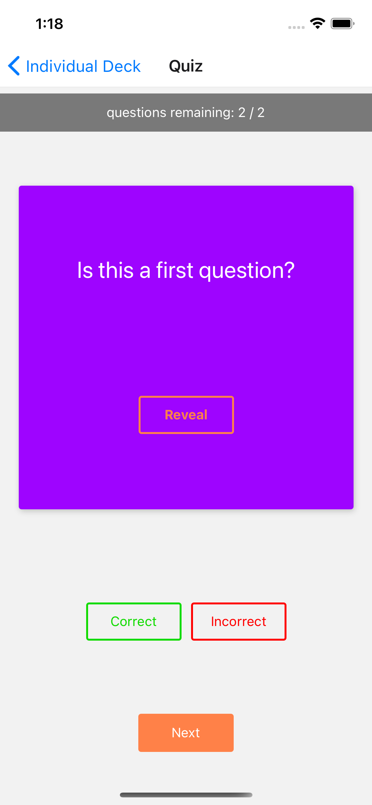

# Udacicards
## by Josh Cooter
## [Twitter](http://www.twitter.com/thejoshcooter) | [Linked In](https://www.linkedin.com/in/joshcooter/) | [Github](http://www.github.com/thejoshcooter)
<br />

# Description
Udacicards is a React native flash card application built as a capstone project for the Udacity React Nanodegree.  

In its current release, it is an ***IOS tested application*** that allows the user to manage decks of flash cards, quiz themselves on those cards, generate quiz scores, and receive daily push notification reminders to ensure they practice regularly.  

Udacicards was built using barebones React Native CLI, ***not Expo***.

*Future releases will include feature updates as well as Android support.*

# Documentation
[Prerequisites](#Prerequisites)  
[Installation](#Installation)  
[Technologies](#Technologies)  
[Overview](#Overview)  
[Releases](#Releases-&-Features)  
[Troubleshooting](#Troubleshooting)

# Prerequisites
- Node
- Watchman
- React Native CLI
- Xcode
- CocoaPods  

Please note that all required prerequisites and their installation instructions can be found [in the React Native docs](reactnative.dev/docs/environment-setup).  

# Technologies
- React Native
- React Native CLI
- iOS and Xcode
- [Styled components](https://styled-components.com/)
- [react-navigation](https://reactnavigation.org/)
- Custom mock API w/AsyncStorage
- [@react-native-community/push-notifications-ios](https://github.com/react-native-push-notification-ios/push-notification-ios)

# Installation

### Clone repository
```bash
git clone https://github.com/thejoshcooter/u-udacicards.git
```

> ***WARNING!*** Before proceeding, please ensure you have completed all [prerequisite](#Prerequisites) installation and setup, otherwise you may run into issues.

### Install dependencies from project directory
```bash
yarn install
npx pod-install
```

### Configure Xcode for push notifications


From the project root, navigate to the `ios` directory and open `udacicards.xcworkspace` in order to launch your Xcode workspace.  

Select the Udacicard project from the left sidebar, and navigate to the `Signing and Capabilities` tab from the project space on the right.  

Add two new capabilities by pressing the '+ capability' button on the top left of the menu.

The two new capabilities to add are:
- Background Modes: Remote Notifications
- Push Notifications

### Run the React Native application
First, you will need to start Metro (React Native's JavaScript bundler) in it's own terminal window.

You can open a new terminal and run the following from the project root.  

```bash
yarn react-native start
```

Now that Metro is running, we will start our React Native app in our IOS simulator from a new terminal.

```bash
yarn react-native run-ios
```

> If you are having issues with Xcode, Metro, or React Native CLI - please refer directly to the React Native docs: [Setting up the development environment](reactnative.dev/docs/environment-setup)  

Congratulations! You should be all set up to run Udacicards in your local iOS simulator! Simulating the environement can sometimes cause some unexpected behaviors, and so if you run into issues aside from setting up the environment, please refer to the [troubleshooting section](#Troubleshooting).

# Overview

### Home View & Decks  

[](assets/decks.png)

When the app is launched, the user is greeted by a home view that first requests permissions to push notifications. Once the user accepts, they can view all of their current decks. The decks are initialized with a few demo decks from the mock API.

### Adding a Deck

[](assets/create-deck.png)

This view allows users to add a new deck to their stack by giving it whatever title they choose. Upon successful deck creation, they are routed to the view for that individual deck.

### Individual Decks

[](assets/deck-view.png)

From the individual deck view, users can see the title of the deck and how many cards are currently in the deck. They also have the ability to either add a new card to the deck or begin a quiz for that deck.

### Adding a Card

[](assets/create-card.png)

This view allows the user to add a card to the deck that they navigated from by providing a question and an answer. Upon successful card creation, the user is routed back to the individual deck view.

### Deck Quizzes

[](assets/quiz-question.png)

If a user chooses to begin a deck quiz, they are routed to the quiz view which presents the user with a card from the deck that is flipped to the question side. The user can then make a guess.

[](assets/quiz-answer.png)

Once the user's guess has been made, they can press reveal in order to flip to the answer side fo the card. Depending on whether their guess was right or wrong, they can mark that particular card as correct or incorrect before moving on to the next card.  

The quiz view also keeps track of remaining unanswered questions at the top.

[](assets/results.png)

At the end of the quiz, and only once there are no remaining unanswered questions, the user can navigate to the results screen to see their stats for the quiz.  

From here they can choose to either restart the quiz to go again, or navigate back to the individual deck view.

Also, when results are posted it means the users has successfully completed their minimum one quiz per day, and so the reminder notification for the day is cleared, and a new reminder is set for the following day.

### Notifications

[](assets/notification.png)

The app uses the react community push-notification-ios package in order to implement push notification reminders for daily quizzes. Push notifications are set for each day at 8pm to remind the user to complete at least one quiz for the day.

### Settings

[](assets/settings.png)

A basic settings view has been implemented to build additional functionality into the app now and in the future.

[](assets/settings-storage.png)

From the storage settings, a user can choose to reset the app's AsyncStorage and reinitialize the app with the original dummy data from the mock API.

[](assets/settings-notifications.png)

I have also implemented all of the methods necessary for testing and debugging notifications in the notifications settings.  

From here, users can send a test notification that is delivered in seconds, set up future notifications, manually set notification permission, check current permissions, check to see what the currently scheduled notifications are, clear all currently scheduled notifications, and manually run the schedule reminder method that handles the daily quiz reminder notifications.

# Releases & Features
## v1.0 [current]
Release Date: 05/31/2021
- Request notification permission access on launch
- Automatically set daily quiz reminder on permission access
- Custom mock API uses AsyncStorage as store
- Demo decks displayed on Home view
- Pull down to refresh decks on home view
- Ability to add user decks with respective views
- Ability to delete user decks and reroute user
- React-navigation nested stack and tab navigators
- Ability to add cards to decks with respective views
- Ability to start deck quiz and receive results on completion
- Quiz features card displays, question tracking, and user ability to mark answers as correct or incorrect
- Completing a quiz clears the current reminder notification and sets a new reminder for the same time the following day
- Settings view
- Ability to clear AsyncStorage store and initialize with default data from settings
- Ability to test, troubleshoot, and debug push notifications from settings  

## v1.1
Release Date: ***TBD***

# Troubleshooting

Below are some common issues that you might potentially run into while trying to build and run the app, and the solutions that worked for me.

### Issue
> I'm getting an error in the simulator that says  
> ```bash
> no bundle URL present
> ```

### Solution
The app will not run without the Metro bundler active. Make sure that Metro is actively running in its own terminal instance. If it is already running, kill the process, and restart metro with  
`yarn react-native start`  

### Issue
> I tried running the app, but after a successful build it appears to be blank - I'm not getting any data or decks.

### Solution
This is most likely another issue with the Metro connection to the app. Nothing works properly if Metro isn't connected.

You should first kill all processes and close your terminals. Then delete the app from your iOS simulator. Open a new terminal and first start Metro in its own terminal.  

```bash
yarn react-native start
```

Once Metro is confirmed to be successfully running, go ahead and rebuild the app for the simulator.

```bash
yarn react-native run-ios
```

Once the app has been successfully built, press `cmd + ctrl + z` in your iOS simulator and open the `debug with chrome`.

If Metro is running properly and connected, you should be able to see an active session in the chrome debugger window.


If you are seeing no active session, then you should first try to reload the app to see if you can connect to an active session, and if that fails, repeat the process above.

  

## Issue
> I'm not getting any push notifications and nothing is showing up when the app is in the foreground.

## Solution
The issue with notifications (especially with push notifications with the app in the foreground), is most likely due to not having your Xcode setup properly.  

Please make sure to follow all of the installation instructions carefully, particularly the [Configure Xcode for push notifications](###Configure-Xcode-for-push-notifications) section.

If you would like to run a test notification without having to wait for the daily quiz reminder time, you can navigate to the `Settings > Notifications` view within the app and run a test notification that arrives in 5 seconds by pressing the `Test Notification` menu item.